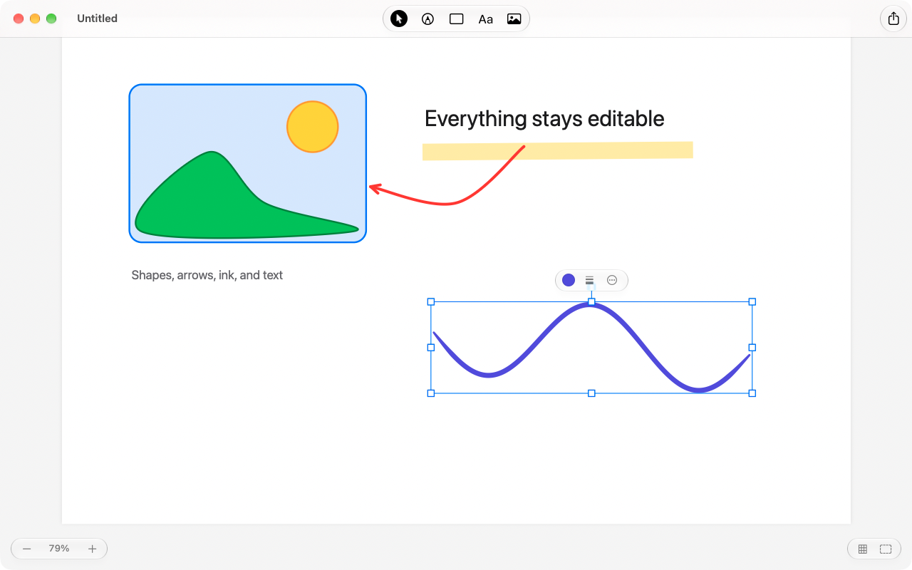

# Bristle

Bristle is a small, native macOS drawing app. It has the immediacy of a paint program — pick a pencil and draw — but everything you draw stays an editable object: shapes, lines and arrows, freehand strokes, text, and images. Nothing is flattened into pixels behind your back, so you can open a screenshot, mark it up, save an ordinary PNG, and reopen it later with every annotation still editable. Bristle requires macOS 13 or newer, works entirely offline, and has no third-party dependencies.



## Install

Download Bristle from [GitHub Releases](https://github.com/PoteNad/bristle/releases), or install it with Homebrew:

```sh
brew install --cask PoteNad/tap/bristle
```

Homebrew includes Bristle in its normal `brew upgrade` cycle. To update only Bristle, run `brew upgrade --cask bristle`.

The Homebrew cask verifies the app bundle and removes its quarantine attribute so Bristle can open normally. Direct downloads are not Apple-notarized, so macOS may require **Open Anyway** in **System Settings → Privacy & Security** on first launch.

## How it works

- **The canvas** is a sheet of a set size, white or transparent, like a paint program's. It sets what is exported and printed. Objects can reach past its edges and are kept, shown faded, and left out of exports. Canvas ▸ Canvas Size, Crop to Selection, Fit Canvas to Drawing, and the canvas rotate and flip commands move objects, never pixels.
- **The toolbar** holds the tools, as Freeform's does: Select, Draw, Shapes (click it again for rectangles, ellipses, polygons, lines, and arrows), Text, and Image. Every tool also has a key: V Select, P Pencil, B Brush, M Highlighter, E Eraser, L Line, A Arrow, R Rectangle, O Ellipse, G Polygon, T Text, F Fill, I Eyedropper. Hold Space to pan.
- **Draw** shows a bar at the bottom of the window with Select, the drawing tool — click it again for the pencil, brush, highlighter, erasers, fill, and eyedropper, with a row of line widths — and the tool's colour.
- **The format bar** appears above whatever is selected, with its fill, border or line colour, line width and style, arrowheads, text size and alignment, crop for images, and a menu of the Arrange commands.
- **The Palette** opens from any colour swatch: Bristle's colours, the colours used recently, opacity, and More Colors for the system colour panel. Format ▸ Show Palette (⇧⌘C) opens it too.
- **The zoom control** at the bottom left and **the canvas control** at the bottom right hold the zoom level, the grid, and the canvas's size and background.
- **Opening an image** makes a canvas the image's size with the image locked in place underneath, ready to mark up. Saving an unedited image writes back the same bytes.
- **PNGs keep the drawing.** A PNG saved by Bristle is an ordinary image everywhere else, and also carries the drawing in a private chunk, so it reopens in Bristle with every object editable. If the image is changed in another app, Bristle notices that the pixels no longer match, opens the image as it is now, and offers to restore the earlier objects.

Bristle deliberately leaves out layers panels, filters and photo adjustments, custom brush engines, blend modes, animation, collaboration, and anything that needs an account or the network. The eraser and the fill tool work on objects, not pixels: the eraser removes objects, or with the stroke eraser, the parts of freehand strokes it passes over; the fill tool fills shapes and the canvas background.

## Features

- Native document windows and tabs, autosave, versions, recovery of unsaved drawings, Revert, Duplicate, Rename, and Move.
- Pencil, pressure-sensitive brush, and highlighter, with smoothing, tablet pressure, and speed-based thickness with a mouse.
- Lines and arrows with arrowheads, curves, and ends that attach to shapes and follow them; rectangles with rounded corners, ellipses, and polygons that can be curved.
- Text typed in place, with the font panel, sizes, alignment, and colours.
- Images placed from files, the clipboard, drag and drop, and Continuity Camera and Sketch, with cropping (double-click an image) and flipping.
- Move, resize, rotate, duplicate (⌘D, or Option-drag), align, distribute, group and enter groups, lock, and stacking order, with alignment guides, an optional grid, and nudging with the arrow keys.
- Copy Style and Paste Style, Select All, and Tab to move from object to object.
- Copying writes Bristle objects, PNG, and PDF, so a copy pastes as editable objects in Bristle and as a picture everywhere else; objects can be dragged out to other apps.
- Export as PNG (optionally editable in Bristle), SVG, PDF, or JPEG at 1×, 2×, or 3×; Print; and Share.
- Zoom from 5% to 3200% by pinching, ⌘-scrolling, the zoom control, or ⌘+, ⌘−, ⌘0, and ⌘9.
- Light and dark appearances, full keyboard access, and VoiceOver descriptions of every object on the canvas.

## File format

A `.bristle` file is JSON, written with one object per line so it reads and diffs well:

```json
{
  "type": "bristle",
  "version": 1,
  "paper": {"width":1600,"height":1000,"background":"#FFFFFF"},
  "elements": [
    {"id":"4k2j9x","type":"rectangle","x":120,"y":80,"width":300,"height":180,"fill":"#DCEBFF","cornerRadius":16},
    {"id":"9sd0q1","type":"arrow","x":420,"y":170,"width":180,"height":40,"points":[[0,0],[180,40]],"startBinding":{"element":"4k2j9x","anchor":[0.5,0.5]}}
  ],
  "files": {}
}
```

- `paper` gives the canvas size in points, its `background` colour or `null` for transparent, and optionally its `resolution` in pixels per inch.
- `elements` lists objects from back to front. Each has an `id`, a `type` (`rectangle`, `ellipse`, `polygon`, `line`, `arrow`, `freehand`, `text`, or `image`), and a frame (`x`, `y`, `width`, `height`) that `rotation` (radians, clockwise) turns about its centre. Values left at their defaults are omitted: `stroke` (a colour, or `null` for none, default `#1D1D1F`), `strokeWidth` (3), `dash` (`solid`, `dashed`, or `dotted`), `fill`, `opacity` (1), `cornerRadius`, `locked`, and `groups`, the ids of the groups the object belongs to, innermost first.
- Polygons, lines, arrows, and freehand strokes have `points` relative to the frame's corner; strokes add `brush` (`pencil`, `pen`, or `highlighter`) and optional `pressures`, and lines add `curved`, `startArrowhead` and `endArrowhead` (`none`, `arrow`, `triangle`, `circle`, or `bar`), and `startBinding` and `endBinding`, which attach an end to another object at an `anchor` given in that object's unit coordinates.
- Text has `text`, `font` (a PostScript name, or omitted for the system font), `fontSize`, `textAlign`, and `fixedWidth` when it wraps at its width.
- Images have `file`, a key into `files`, which holds each image's type and its original bytes in base64, and optionally `crop` (`[x, y, width, height]` of the image, from 0 to 1), `flipX`, and `flipY`.
- Colours are `#RRGGBB` or `#RRGGBBAA` in sRGB. Readers ignore members they don't know, and a newer major `version` is refused rather than misread.

In a PNG saved by Bristle, the same JSON is stored zlib-compressed in a private, unsafe-to-copy `brSC` chunk, with one more top-level member, `pixels`: a SHA-256 hash of the image's pixels, which tells Bristle whether the image was changed elsewhere.

## Build from source

Bristle needs Xcode or the Command Line Tools with the macOS 26 SDK or newer. The built app still runs on macOS 13 and newer.

```sh
./scripts/build.sh
open build/Bristle.app
```

The build is optimized and ad-hoc signed for the current Mac. Open `Package.swift` in Xcode to work on the source. Run `./scripts/check.sh` for the full test suite, which includes end-to-end checks of drawing with the pointer, saving, opening, byte-identical round trips, and restoring unsaved drawings. After editing the icon in Icon Composer, run `swift scripts/make-icon.swift` to update `Assets/Bristle-Liquid.png` and `Assets/Bristle.icns`.

## Using the canvas in another app

The canvas is the `BristleCanvas` library in this package, separate from the Bristle app, and the drawing model, file format, and rendering are in `BristleCore`. `CanvasView` provides every tool, selection, text editing, the clipboard, drag and drop, zoom, and VoiceOver support. The app adds documents, the toolbar, the drawing and format bars, the Palette, and Settings around it.

```swift
import BristleCanvas
import BristleCore

let drawing = Drawing(scene: Scene(paper: Paper(width: 1200, height: 800)))
drawing.undoManager = undoManager
let canvas = CanvasView(drawing: drawing)
canvas.tool = .pen
window.contentView = canvas.scrollView
```

Every change goes through `Drawing`, so it can be undone, and posts `drawingDidChange`. `SceneFile` reads and writes `.bristle` JSON, and `EmbeddedScene` reads and writes PNGs that carry a drawing.

## License

MIT — see [LICENSE](LICENSE).
